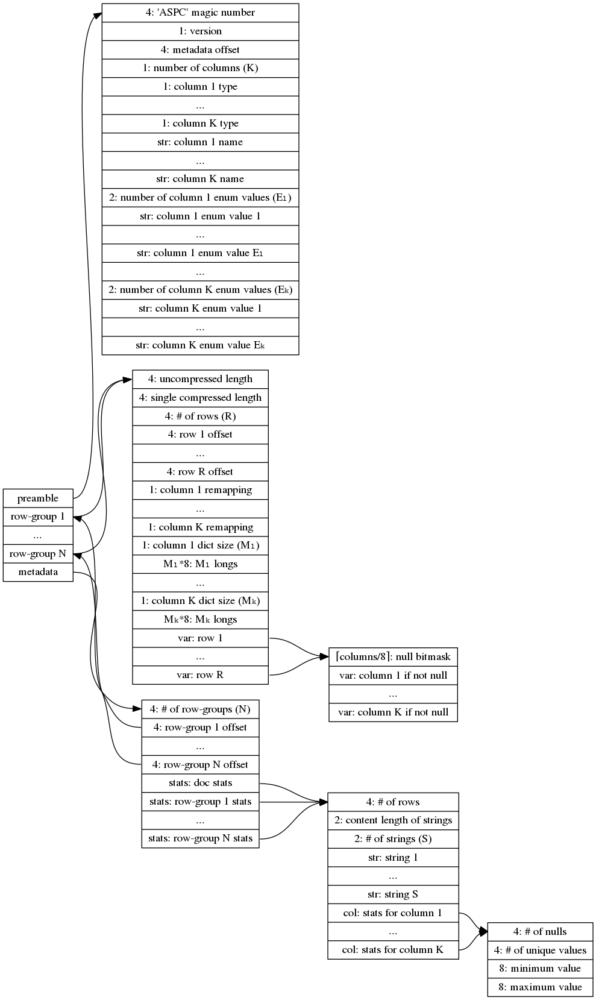

# aspic

_This really only makes sense in conjunction with [punctual](https://github.com/cldellow/punctual/)._

A plugin for local data on Presto:

- convert a variety of UTF-8 CSV formats to a binary format
- parallelizable queries
- lazy field evaluation
- LZ4 compression
- block-range indexing to skip unnecessary sections
- infer categorical fields to store repetitive data efficiently

## What?

The standard way to query a CSV in Presto might be via Hive.

In particular, you'd use its `org.apache.hadoop.mapred.TextInputFormat` format
coupled with `org.apache.hadoop.hive.serde2.lazy.LazySimpleSerDe`, or maybe
`org.apache.hadoop.hive.serde2.OpenCSVSerDe` if your CSVs have quoted fields.

`TextInputFormat` makes no assumptions around the data's compression codecs or
whether it is local or remote. `LazySimpleSerDe` and `OpenCSVSerDe` make no
assumptions about what input format will be feeding them--
they merely ask that the format be able to produce Hadoop's `Text` objects.

This comes with a severe performance penalty due to needless copying of buffers.
Presto also takes a defensive copy of the buffer that Hive hands it.

`aspic` avoids the need for defensive copies, and implements a few other tricks
to speed things up, too.

## Format

